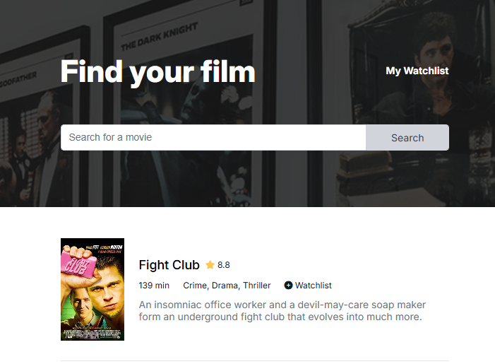

# Movie Watchlist

A web application that allows users to search for movies using the OMDB API, view movie details, and save them to a personal watchlist.

[Live Demo](https://sage-pithivier-6b2939.netlify.app/)



## About

This project was created as part of The Frontend Developer Career Path at Scrimba. It demonstrates how to build a multi-page application that interacts with an external API and utilizes browser local storage to persist user data.

## Features

- Search for movies by title
- View detailed information about movies including:
  - Title, rating, runtime, and genre
  - Plot summary
  - Movie poster
- Add movies to your personal watchlist
- Remove movies from your watchlist
- Persistent storage of watchlist using localStorage
- Responsive design that works across devices

## Technologies

- HTML5
- CSS3
- JavaScript (ES6+)
- Fetch API
- OMDB API
- LocalStorage API
- ES6 Modules
- Font Awesome for icons
- Google Fonts (Inter)

## Project Structure

```
movie-watchlist/
├── css/
│   └── style.css
├── html/
│   └── watchlist.html
├── images/
│   └── background.png
├── js/
│   ├── config.js (not included in repo - contains API key)
│   ├── constants.js
│   ├── index.js
│   ├── util.js
│   └── watchlist.js
├── index.html
└── README.md
```

## How it works

### API Integration

The application uses the [OMDB API](https://www.omdbapi.com/) to fetch movie data:

1. First, it searches for movies by title using the search endpoint
2. Then, it fetches detailed information for each movie using the ID endpoint
3. Movie data is displayed in cards with options to add to watchlist

### Data Persistence

The watchlist functionality uses the browser's localStorage to save the user's movie selections:

- Movie IDs are stored in an array in localStorage
- When visiting the watchlist page, the app fetches full details for each saved movie ID
- Users can remove movies from their watchlist, which updates localStorage

### Modular Architecture

The application uses ES6 modules to organize code:

- `index.js`: Handles the search page functionality
- `watchlist.js`: Manages the watchlist page functionality
- `util.js`: Contains shared utility functions
- `constants.js`: Stores application constants
- `config.js`: Contains API key (not included in repository)

## Setting Up

### Prerequisites

- You need an API key from [OMDB API](https://www.omdbapi.com/)

### Installation

1. Clone the repository:
```bash
git clone https://github.com/phattp/movie-watchlist.git
cd movie-watchlist
```

2. Create a `config.js` file in the `js` directory:
```javascript
export const API_KEY = "your_omdb_api_key_here";
```

3. Open `index.html` in your browser

## What I learned

- Working with external APIs using the Fetch API
- Implementing multi-page functionality
- Using localStorage for client-side data persistence
- Creating modular code with ES6 modules
- Handling asynchronous operations with async/await
- Implementing a responsive design
- Error handling in fetch operations
- DOM manipulation based on data from an API

---

Created by [Phatthara Pisootrapee](https://github.com/phattp) | [The Frontend Developer Career Path at Scrimba](https://scrimba.com/learn/frontend)
